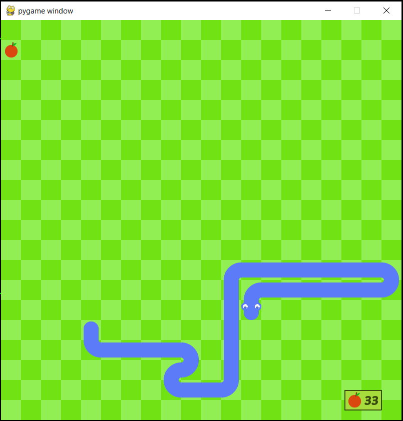

# Project for IITB Summer of Code 2021 - Snake AI

## Building the classic snake game using python pygame and making it intelligent with reinforcement learning

Project mentor - [Shubham Lohiya](https://github.com/shubhlohiya)

 \
Details about each stage can be found in the respective folders.

### Stage 1 (basic-snake-game) : 1st April, 2021
Making a basic snake game, no reinforcement learning involved. The _objective_ is to collect as many apples as possible without making the snake crash into the walls or itself. The _game controls_ are the arrow keys.

I've recreated the snake game by Clear Code which you can find on GitHub, [here](github.com/clear-code-projects/Snake) and on his YouTube channel, [here](https://www.youtube.com/watch?v=QFvqStqPCRU).

### Stage 2 (value-iteration) : 12th May, 2021
Implementing the value iteration algorithm to solve MDPs (Markov Decision Processes) and formulating a maze as an MDP (the current implementation is quite inefficient and memory heavy but is logically correct). This is a solution to this [project](https://www.cse.iitb.ac.in/~shivaram/teaching/old/cs747-a2020/pa-2/programming-assignment-2.html).

### Stage 3 (windy-gridworld) : 30th May, 2021
An RL agent attempts to navigate a windy gridworld and finds the shortest path from start to finish. Different algorithms are applied to solve this problem and their performance is graphically compared, namely, SARSA, Q-Learning and Expected SARSA. This is a solution to a problem on page 152, [_Reinforcement Learning_](http://incompleteideas.net/book/RLbook2020.pdf) by Barto and Sutton.

### Stage 4 (SnakeRL-v1) : 10th July, 2021
This is a solution to the original problem statement of this project. It uses SARSA, Q-Learning or Expected SARSA to train a snake to earn high rewards in the snake game. While this approach performs quite well (with a maximum score of 58 fruits on one trial) there are still some limitations such as the snake's inability to detect that it is entering a closed loop and trapping itself. This code allows both training and graphical evaluation of the snake's performance.

### Future work
I am trying to learn about Deep Reinforcement Learning throught Stanford's CS231n. I hope to explore Deep RL approaches to this and other games in the future. 

### Requirements
This project uses python 3.8.8 along with numpy, matplotlib and pygame. To install the external libraries using pip run the following code.
~~~
pip install pygame
pip install numpy
pip install matplotlib
~~~

### Thanks
I want to thank my mentor [Shubham Lohiya](https://github.com/shubhlohiya) for his constant guidance throughout this project despite his busy schedule. The project resources created by him helped me pace my learning and gave a good mix of theoretical and practical exposure. This is my first time working on a coding project and his support has definitely helped me in overcoming my aversion to and fear of coding. He was always there to answer our doubts and review our code, giving us suggestions on code presentation and style as well as correcting logical flaws. I also want to thank IIT Bombay for giving us this opportunity to explore programming in Summer of Code, with such interesting coding tasks and enthusiastic mentors.

### Additional Resources
[Basic snake game demo](https://drive.google.com/file/d/1u0gzR0Khpb7Z9phYH4RnklGMcEfqtCSm/view?usp=sharing) \
The project timeline as well as links to learning resources can be found at [Project Resources](https://www.notion.so/SOC-Snake-AI-Project-471ff57983a24f749ca0ec08df8c9472) \
[Windy gridworld demo](https://drive.google.com/file/d/1Wq-gtF8vT03Jqy-7t7ziinwTB0la-mZD/view?usp=sharing)\
[Snake training in progress](https://drive.google.com/file/d/1JjylKlK8kachEsdyanH9KO7Az1WJMub8/view?usp=sharing)
